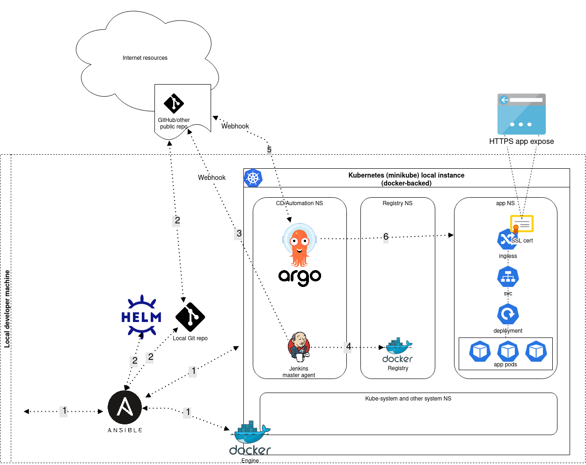

# adjust-test

## Initial task

### Scenario  

A web app running on port 80 needs to be deployed to a Kubernetes install. For the sake of
this test, please tailor your answer to use a local instance of minikube.  
You are tasked with automating the deployment process pipeline, to containerize and deploy
the application to Kubernetes.
Please use the sample Ruby application https://github.com/sawasy/http_server.
It runs on TCP port 80. The application also exposes a health check and endpoint at the route
/healthcheck.  

You can use any infrastructure as code tools to package, deploy and run the application. For
example: Ansible, Terraform, K8s, etc.  
Please make sure you commit each step of your progress with descriptive commits so we can
follow up with the development of the project.  

You are tasked with automating the deployment process pipeline, to containerize and deploy
the application to Kubernetes.  

### Requirements  

Please ensure your submission includes all of the following.  

- Highly available and load balanced environment is required  
- Docker is the tool to support it  
- Ensuring the application is started before served with traffic  
- Enhancing availability with probes  
- Running application as non-root  
- A README with:  
  - step-by-step instructions to recreate the setup  
  - the Strategy/Architecture  
  - Instructions on how to connect to the running application  
- All the scripts, configs, playbooks, manifest etc should be provided on a DVCs, preferably Github.  
- If your test requires a non-current version of software, please explain why.  

## Solution

### Preface

I am not really proficient in classic devops tasks being more of an infrastructure engineer/architect. 

After looking at the requirements I wanted to create and publish something like this:

 

Local developer machine - something Linux-based. Yes probably that could work on Mac but the only Mac I have is my corporate laptop without root/sudo rights and without any Docker/virtualization software installed. Besides you can easily repeat that scenario with any Linux-based VM locally or in the cloud. 

I tested it on my personal laptop with Ubuntu 21.04. So to recreate the environment you need either Ubuntu-based PC/laptop or any Ubuntu-based VM.

After reading the task more thoroughly I assume authors wanted from candidates to create the solution basically from scratch so at the start we have some freshly installed linux machine with Internet access of course.

Next, following the numbers on the scheme:

0) We install Ansible as our primary automation tool for infrastructure setup

1) Setup our infrastructure with Ansible: install all necessary packages, install Docker and minikube along with our private image registry.

2) Setup our local and remote git repo (assuming all code and manifests and other artifacts are written, tested and ready to deploy). Setup Helm for further deploying and updating system software via Helm charts in the Kubernetes cluster (and maybe our app too if I could and have time to package it into Helm chart)

3) Setup the automatic image building tool (Jenkins for example) that ideally should integrate via webhook with our remote git repo and rebuild our image with autoincrementing its version on new commits.

4) Push the newly built image into our private registry. 

5) Setup the automatic deployment tool (ArgoCD for example) that should also integrate via webhook with our remote git repo 

6) Deploy/redeploy our app to Kubernetes cluster (ok not cluster but single-node-everything on minikube)

7) Publish our app for external users with access via the Kubernetes ingress (ideally with HTTPS access and self-signed certificate that could be easily changed to Letsencrypt or something similar in normal Kubernetes cluster)


### What could go wrong?

<u>First</u>, it took too much time for me to properly dockerize the app (I am not familiar with Ruby at all)

<u>Second</u>, I discovered a lot of problems and limitations in minikube (did not have a lot of experience with minikube/minishift before):

- ingresses do not work as expected when published application is accessed with HTTP (not HTTPS)
- annotations on ingress controller do not work in minikube - I could not make the app work even with self-signed certificate
- apps in different namespaces can't resolve internal kubernetes service addresses (like `service_name.namespace_name.svc.cluster.local`) - one more unexpected behaviour of minikube

<u>Third</u>, my Ansible skills became really rusty with time and even more - trying to run some test playbooks with Ansible roles on my local machine (--connection=local) resulted in some unexpected errors and some changes simply had not applied correctly.

So I got rid of the idea to make the solution distro-agnostic (so it could work on any Linux machine)

Discovering all of this took too much time so unfortunately I had to hugely simplify the solution making it much less elegant and more straightforward. 

So the primary goal changed to make this all work at least and formally meet all the requirements. 

### The actual working scheme


Following the numbers on the scheme:

0) We install Ansible as our primary automation tool for infrastructure setup

1) Setup our infrastructure with Ansible: install all necessary packages, install Docker and minikube.

2) Setup our local and remote git repo (assuming all code and manifests and other artifacts are written, tested and ready to deploy).

3) Install Helm with Ansible and use it for deploying our private image registry inside minikube.

4) Locally build the image (in separate Ansible playbook) and push the newly built image into our private registry. 

5) Deploy our app to minikube with separate Ansible playbook.

6) Publish our app via NodePort and access it with IP address, not FQDN as I initially planned.

I had to drop the idea of automatic build/deployment - I am not so proficient with Jenkins and have not tried ArgoCD (but I like what I seen in demos/videos) - and simply spent too much time on getting app and minikube work...

### Meeting the requirements

Highly available and load balanced environment is required

- This is kinda tricky question because you simply cannot ensure high availability and proper load balancing on minikube single node cluster. The only thing I could do is to make a Kubernetes deployment with multiple pod replicas - Kubernetes Service object acts like a logical load balancer itself and routes the traffic to several app instances inside pods.
  In real life you can implement a lot of different approaches to ensure HA and LB setup - highly available multi-AZ kubernetes clusters, highly available load balancers/ingress controllers, highly available storage backends for persistent storage if needed (S3, database clusters, file servers etc...), CDNs and GeoLBs, etc, etc...

Docker is the tool to support it 

- well, Docker it is :)

Ensuring the application is started before served with traffic

- I implemented Kubernetes [startup probe](https://kubernetes.io/docs/tasks/configure-pod-container/configure-liveness-readiness-startup-probes/#define-startup-probes) for that

Enhancing availability with probes 

- I implemented Kubernetes [liveness and readiness probes](https://kubernetes.io/docs/tasks/configure-pod-container/configure-liveness-readiness-startup-probes/) for that
  Well it turned out that the application sends a plain text to us instead of the HTTP response code. So we cannot simply use HTTP probes cause webserver responses in plain text. Currently Kubernetes does not support custom response values except 200-399 HTTP response codes: https://github.com/kubernetes/kubernetes/issues/55405
  Instead I used exec probe with `curl localhost/healthcheck` inside the container

Running application as non-root 

- Dockerfile contains all necessary directives along with comments to run the app under regular user 

A README with:  

step-by-step instructions to recreate the setup  

the Strategy/Architecture  

Instructions on how to connect to the running application

- well you are reading it now

All the scripts, configs, playbooks, manifest etc should be provided on a DVCs, preferably Github.  

- Github it is

If your test requires a non-current version of software, please explain why.  

- all software version are latest - Ansible, Docker, base official Ruby docker image, minikube, Helm,...

### Step-by-step installation instructions

#### Variables description

Before installation you can look at `./vars/main.yaml`

The options you can setup there:

`registry_fqdn`: private registry DNS name for external access. (currently not implemented) 

`registry_port`: private registry port, 5000 by default

`registry_nodeport`: private registry port exposed via NodePort, by default 31500

`registry_expose_port`: private registry port exposed via Ingress, by default 15000 (currenty Ingress not implemented, instead exposed via `kubectl port-forward`)

`app_fqdn`: application DNS name for external access (currently not implemented)

`app_nodeport`: application port exposed via NodePort, by default 32000

`app_expose_port`: application port exposed via kubernetes Service, by default 8800

`app_target_port`: application port exposed in the Docker contained, as initial task says the app runs on port 80 but it could possibly be changed (for example port 443 for SSL)

`app_image_name`: application Docker image name in our private registry, by default - ruby-app 

`app_image_version`: Docker image version in our private registry. By default it is 1.0.1, you should change/increment it on developing and rebuilding the image

`app_namespace`: Kubernetes namespace name for publishing the app, by default "develop"

`app_label`: Kubernetes app label that is applied on all the application resources, by default "ruby-app"

`app_replicas`: Initial number of replicas in Kubernetes deployment - 3 by default. 

#### Installation process

1. You need a Ubuntu-based host (tested on 21.04 but I assume any actual version like 20.x or 18.x is OK )

2. Install Ansible according to the [official instruction](https://docs.ansible.com/ansible/latest/installation_guide/intro_installation.html#installing-ansible-on-ubuntu)

3. Clone the repository somewhere inside your home directory:

   ```bash
   $ git clone https://github.com/fatalwithin/adjust-test
   $ cd ./adjust-test
   ```

4. Prepare the infrastructure:

   ```bash
   $ ansible-playbook ansible-prepare-hosts.yaml -K
   ```

   Enter your root password. This is the only time you need your root password, it is not required in next playbooks.

   After finishing this playbook you should have working Docker and latest stable version of minikube on your machine. 

   You can check it with `kubectl` command:

   ```bash
   $ kubectl version
   Client Version: version.Info{Major:"1", Minor:"21", GitVersion:"v1.21.3", GitCommit:"ca643a4d1f7bfe34773c74f79527be4afd95bf39", GitTreeState:"clean", BuildDate:"2021-07-15T21:04:39Z", GoVersion:"go1.16.6", Compiler:"gc", Platform:"linux/amd64"}
   Server Version: version.Info{Major:"1", Minor:"21", GitVersion:"v1.21.2", GitCommit:"092fbfbf53427de67cac1e9fa54aaa09a28371d7", GitTreeState:"clean", BuildDate:"2021-06-16T12:53:14Z", GoVersion:"go1.16.5", Compiler:"gc", Platform:"linux/amd64"}
   ```

   

5. Prepare the private image registry.

   ```bash
   $ ansible-playbook ansible-prepare-registry.yaml
   ```

   Kubernetes/openshift modules for Python can spawn pop-up windows with KDE wallet permissions, you can close and ignore that windows.

   After finishing this playbook you can check your registry:

   ```bash
   # 15000 is "registry_expose_port" variable from ./vars/main.yaml
   $ export REGISTRY=127.0.0.1:15000 
   
   $ kubectl get deployments private-docker-registry --namespace kube-system
   NAME                      READY   UP-TO-DATE   AVAILABLE   AGE
   private-docker-registry   1/1     1            1           7h39m
   
   $ curl $REGISTRY/v2/_catalog
   {"repositories":[]}
   ```

   The registry exposed to localhost so we could anonymously push images into it. For the purpose of this test task I wanted to get rid of any authentications or account creations on either external or internal services. Of course in real world you should have properly configured image registry with authentication, SSL/TLS access and highly available persistent storage.

6. Build your image.

   ```bash
   $ ansible-playbook ansible-build-image.yaml
   ```

   After finishing this playbook you should have your image built and pushed into your private registry:

   ```bash
   $ curl $REGISTRY/v2/_catalog
   {"repositories":["ruby-app"]}
   ```

   

7. Deploy your app based on newly built image:

   ```bash
   $ ansible-playbook ansible-deploy-app.yaml
   ```

   Check your kubernetes deployment after playbook finished:

   ```bash
   $ kubectl get deployments --namespace develop
   NAME       READY   UP-TO-DATE   AVAILABLE   AGE
   ruby-app   1/1     1            1           7h36m
   ```

   

8. Access your app.

   First you get to know your minikube IP address:

   ```bash
   $ minikube ip
   192.168.49.2
   ```

   After that - you can check your app access (32000 is our app_nodeport from `./vars/main.yaml`:

   ```bash
   $ curl http://192.168.49.2:32000
   curl: (1) Received HTTP/0.9 when not allowed
   ```

   Oops... Well let's tell curl to connect to app with HTTP/0.9

   ```bash
   $ curl http://192.168.49.2:32000 --http0.9
   Well, hello there!
   ```

   

### Possible improvements

 - 2 git branches at least - main/develop - currently only 1 main branch
 - proper and working Ansible roles, to make code cleaner and make the solution Linux distro-agnostic
  - separate namespaces for dev/prod env in k8s
  - set limits and requests for pods in Kubernetes (actual for prod environment)
  - set QoS class: Guaranteed for pods in Kubernetes (actual for prod environment)

  - canary/a-b testing deployment strategies instead of default rollout one-by-one pod replacing stategy
  - better templating/maybe with packaging the app into Helm charts
  - proper automatic (really automatic by one button hit) build/deploy
  - vaulted credentials and other sensitive data if needed (currently only anonymous access everywhere for dev and test purposes)
  - external highly available docker registry
  - external hightly available persistent data storage (S3, DB etc) if needed (currently no need for persistent data)
